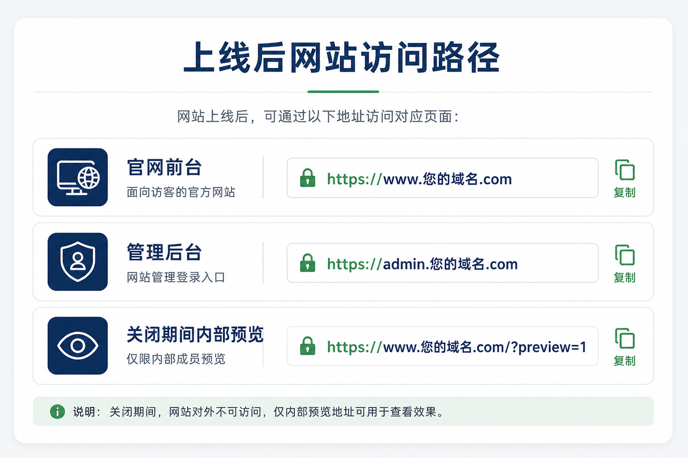
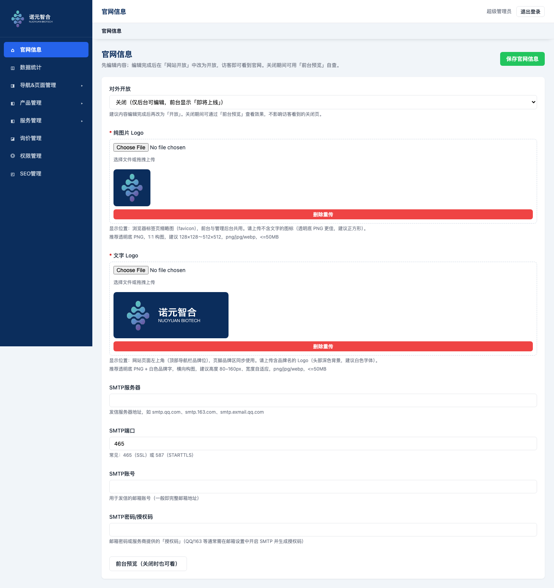
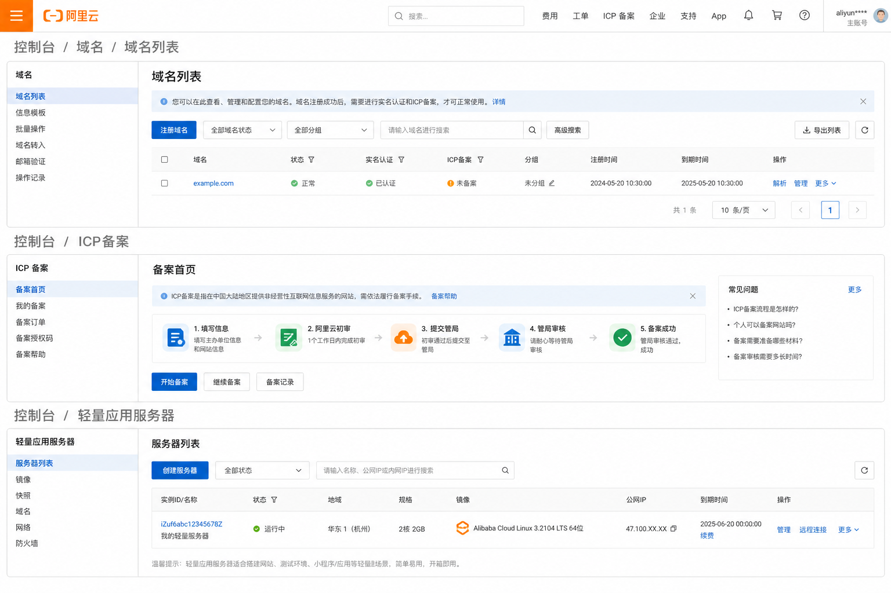
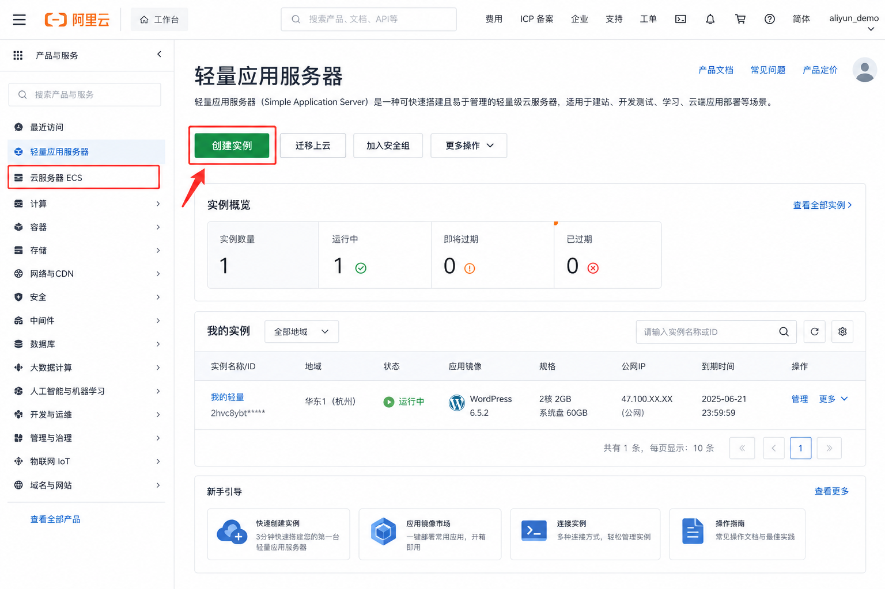
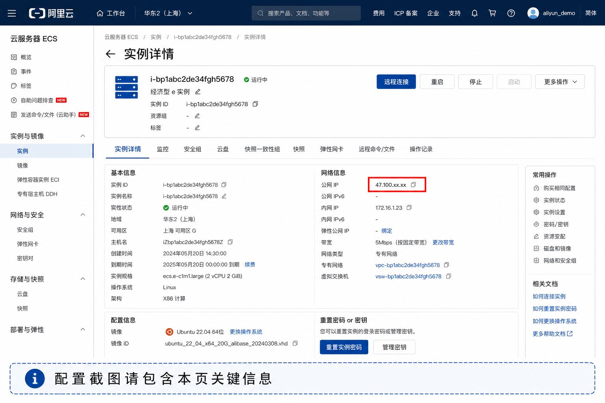
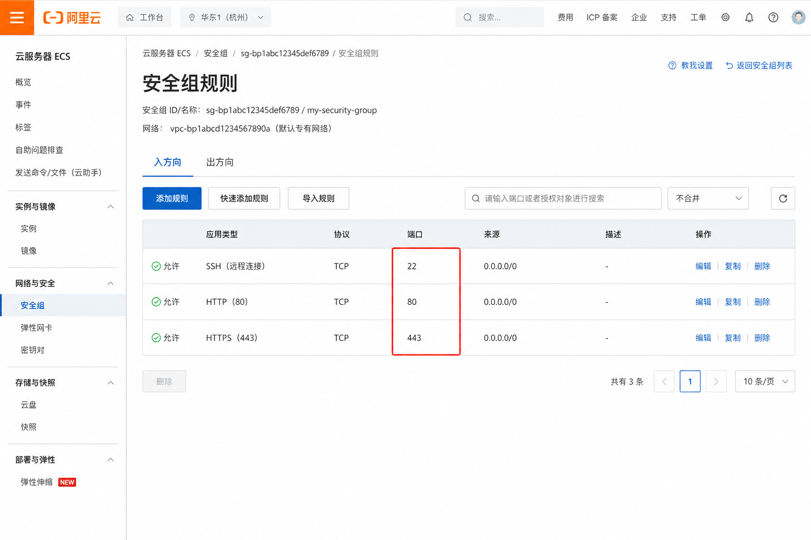

# 诺元智合官网上线 — 客户操作指引（阿里云）

> **适用对象：** 网站归属公司（客户）  
> **请发给客户使用本文件（PDF）。** 服务方内部操作见同目录《服务商上线操作手册-阿里云》。  
> **原则：** 云账号、域名、备案、服务器与费用须落在**贵司主体**名下；服务方负责技术部署与协助，不长期用个人/服务方账号托管贵司官网。

---

## 一、为什么需要贵司亲自操作？

域名实名、云服务器、ICP 备案均须绑定**公司营业执照主体**。账号与资产在贵司名下，便于：

- 合规备案与后续年审  
- 费用、发票归属清晰  
- 日后更换服务方时，网站仍归属贵司  

服务方可协助填写资料、部署网站；**法人核验、短信验证、人脸识别等环节必须贵司配合完成**，服务方无法合法代做。

---

## 二、谁做什么（简表）

| 贵司完成 | 服务方完成 |
|----------|------------|
| 阿里云企业实名 | 远程指导采购/备案选项（验证码仍由贵司点） |
| 域名注册与实名 | 服务器环境安装、网站部署 |
| 购买国内云服务器并付费 | 绑定域名、配置 HTTPS |
| ICP 备案提交与核验 | 导入约定范围内的数据与图片 |
| 开通服务方协作权限（推荐） | 交付后台账号、预览方式与操作培训 |
| 提供对外展示信息与询价邮箱 | 上线日协助复查 |
| 内容验收后打开「对外开放」 | 约定范围内的售后支持 |
| 账号保管与云资源续费 | （按合同）质保期内程序问题修复 |

**配合顺序：**

```text
贵司：企业实名 → 域名 → 买服务器 → 交备案
              ↓（随时把 IP / 协作权限发给服务方）
服务方：可同步装环境、部署（用 IP 或临时方式内部验收）
              ↓
贵司：备案通过 → 通知服务方
服务方：解析域名 + HTTPS → 交付验收
贵司：预览验收 → 后台「对外开放」= 开放 → 正式上线
```

预计：采购当天可完成；备案审核常见为**数个工作日至数周**（以管局为准）。**未备案通过前，不建议用正式域名对公众开放。**

---

## 三、请先准备这些材料

| 材料 | 说明 |
|------|------|
| 营业执照 | 彩色扫描件/照片，信息清晰 |
| 法人身份证 | 正反面 |
| 网站负责人身份证 | 可为法人或授权员工（按备案要求） |
| 对公或负责人手机号 | 用于接收验证码 |
| 公司邮箱 | 用于阿里云、备案通知 |
| 应急联系人 | 姓名、电话 |

建议提前拍好清晰照片，避免备案时反复补传。

---

## 四、上线后网站访问路径（请收藏）

正式上线后，请将「您的域名」替换为实际域名：



| 用途 | 访问路径 |
|------|----------|
| 官网前台（访客） | `https://www.您的域名.com` |
| 管理后台（内部） | `https://admin.您的域名.com` |
| 关闭期间内部预览 | `https://www.您的域名.com/?preview=1` |

说明：关闭「对外开放」时，普通访客打开前台只会看到「即将上线」；内部预览需加 `?preview=1`，或使用后台「前台预览」。

---

## 五、网站开关路径（管理后台）

验收完成前，「对外开放」一般为**关闭**。正式对公众开放时，请在后台修改。

### 5.1 后台菜单位置

登录管理后台 → 左侧 **官网信息**。

路径：`管理后台 → 官网信息 → 对外开放`



1. **对外开放**：验收期间保持「关闭」；确认无误后再改为「开放」，并点右上角 **保存官网信息**  
2. **前台预览**：关闭状态下也可查看完整前台效果  

### 5.2 关闭状态：访客看到的页面


### 5.3 预览模式：内部验收页面

访问 `/?preview=1` 或点击后台「前台预览」：


---

## 六、阿里云控制台路径示意

控制台顶部搜索框也可直接搜关键词：



| 事项 | 控制台路径（示意） |
|------|-------------------|
| 域名购买/实名 | 控制台 → 域名 → 域名列表 |
| 买服务器 | 控制台 → 轻量应用服务器 / 云服务器 ECS |
| ICP 备案 | 控制台 → ICP 备案 |

具体按钮文案以阿里云当前页面为准；拿不准时请把**截图**发给服务方远程指导。

---

## 七、贵司操作步骤（分步）

### 步骤 1：注册阿里云（企业账号）

1. 打开 [https://www.aliyun.com](https://www.aliyun.com)  
2. 注册账号，选择**企业实名认证**  
3. 按提示上传营业执照、法人信息并完成核验  
4. （推荐）为服务方开通**子账号/协作者**，仅授予运维所需权限，**勿交出主账号密码**  

完成后告知服务方：主账号标识（可打码）、是否已开通协作权限。

---

### 步骤 2：注册域名

1. 进入阿里云「域名」产品页  
2. 查询并注册官网域名  
3. 完成**域名实名认证**（与企业主体一致）  
4. 把完整域名发给服务方  

建议规划：

- `www.您的域名.com` → 官网前台  
- `admin.您的域名.com` → 管理后台  

未备案前域名可能暂时无法在中国大陆稳定访问，属正常现象。

---

### 步骤 3：购买云服务器（小白跟点版）

这一步目标：买一台国内服务器，把端口打开，并把 **IP + 登录方式 + 配置截图** 发给服务方。  
下面以阿里云控制台为例（按钮文案可能微调，以页面为准；拿不准就截图发给服务方）。

---

#### 3.1 打开购买入口

1. 登录 [阿里云控制台](https://home.console.aliyun.com/)（须已完成**企业实名**）  
2. 顶部搜索框输入：**轻量应用服务器**（推荐新手）或 **云服务器 ECS**  
3. 进入产品页后，点击 **创建实例** / **立即购买**



> 新手优先选「轻量应用服务器」：页面更简单。若服务方明确要求 ECS，再按对方说的选。

---

#### 3.2 下单时怎么选（对照勾选）

| 选项 | 建议怎么选 | 小白理解 |
|------|------------|----------|
| **地域** | 中国内地，尽量选公司所在省或邻近地域（如华东2-上海、华南1-深圳） | 服务器「放在哪座城市的机房」；要国内备案，**不要选中国香港/海外** |
| **镜像 / 系统** | **Ubuntu 22.04**（或服务方指定版本） | 服务器预装的操作系统；选错后面要重装，尽量一次选对 |
| **套餐 / 配置** | 入门官网常见 2核2G 或以上即可，可按服务方建议 | 电脑「性能」；太小后期可升级 |
| **带宽** | **3Mbps～5Mbps** 起步 | 网站访问速度相关；访客多了再升 |
| **时长** | 按年购买通常更省，以贵司预算为准 | 先买多久 |
| **密码 / 密钥** | 设置**根用户密码**，或创建密钥对并**下载私钥文件保存好** | 相当于服务器的「大门钥匙」；丢失需重置 |

支付请用**贵司阿里云账户**，便于发票与资产归属。

---

#### 3.3 购买完成后：在哪里看「公网 IP」和配置截图

1. 回到 **轻量应用服务器**（或 ECS）控制台 → **实例列表**  
2. 点开刚买的那一台，进入 **实例详情 / 服务器详情**  
3. 在本页找到并记下：  
   - **公网 IP**（一串数字，如 `47.100.x.x`）  
   - **地域**  
   - **镜像 / 系统**（应能看到 Ubuntu）  
   - **带宽**  



**「配置截图」请这样拍（发给服务方）：**

- 截一张 **实例详情整页**（至少包含：公网 IP、地域、系统、带宽）  
- 若列表页也能看到公网 IP，可再附一张 **实例列表** 截图  
- 手机拍照也可以，但请保证文字清晰、不要只拍局部模糊区域  

---

#### 3.4 在哪里放行端口（防火墙 / 安全组）——很重要

网站要用到网页端口 **80**、加密网页 **443**；服务方远程维护需要 **22**（SSH）。  
不放行的话：外面打不开网站，服务方也登不上服务器。

**若买的是「轻量应用服务器」：**

1. 实例详情页左侧或上方找到 **防火墙**（有的版本在「安全」里）  
2. 进入 **防火墙规则** / **防火墙设置**  
3. 点击 **添加规则**，分别放行（或一次添加多条）：  

| 应用类型（可选） | 协议 | 端口 | 策略 |
|------------------|------|------|------|
| SSH（或自定义） | TCP | **22** | 允许 |
| HTTP（或自定义） | TCP | **80** | 允许 |
| HTTPS（或自定义） | TCP | **443** | 允许 |

4. 保存后，确认列表里能看到这三条（如下示意图）



**若买的是「云服务器 ECS」：**

1. 实例详情 → 找到 **安全组** → 点安全组 ID 进入  
2. **入方向** → **手动添加** / **添加规则**  
3. 同样放行 TCP **22、80、443**（授权对象一般先填 `0.0.0.0/0`，表示允许外网访问；若服务方有更严要求按其执行）  
4. 保存后截一张 **安全组入方向规则** 发给服务方（可选但推荐）

> 端口含义一句话：  
> **80/443** = 让访客用浏览器打开网站；**22** = 让服务方用技术方式登录维护（不是给访客用的）。

---

#### 3.5 登录方式在哪里看 / 怎么发给服务方

任选一种（购买时已设定的那种）：

**方式 A：密码登录**

1. 若下单时设置过密码：把该密码通过**安全渠道**发给服务方（不要发到公开客户群）  
2. 若忘记密码：在实例详情找 **重置密码** / **修改密码**，设好新密码后再发  

**方式 B：密钥登录（更安全）**

1. 购买时若选了密钥对，当时应已 **下载 `.pem` 私钥文件**  
2. 把该文件加密压缩后发给服务方（或当面拷贝）  
3. 若未下载且找不到：按控制台提示新建密钥并重置实例密钥（拿不准发截图问服务方）

---

#### 3.6 发给服务方的「一套完整材料」（复制填写）

请一次性发给服务方（文字 + 截图）：

```text
【云服务器信息】
- 产品类型：轻量应用服务器 / ECS（二选一）
- 公网 IP：
- 地域：
- 系统：Ubuntu 22.04（或实际版本）
- 带宽：
- 登录方式：密码 / 密钥（二选一）
- 用户名：一般是 root（以控制台说明为准）
- 密码或密钥：另通过安全渠道发送
【附件截图】
1. 实例详情页（含公网 IP、地域、系统、带宽）
2. 防火墙/安全组规则页（能看到 22、80、443 已放行）
```

---

#### 3.7 常见卡点

| 现象 | 可能原因 | 怎么办 |
|------|----------|--------|
| 列表里看不到公网 IP | 未购买公网带宽 / 看错了内网 IP | 看「公网 IP」字段；或截图发给服务方 |
| 不知道防火墙在哪 | 产品名称不同 | 搜索「防火墙」或「安全组」；把实例详情整页截图发服务方远程指点 |
| 只放行了 80，没放 443 | HTTPS 以后打不开或证书异常 | 按 3.4 补放 **443** |
| 密码发错渠道 | 安全风险 | 立刻重置密码，旧密码作废 |

费用请由贵司账户支付，便于开具发票、资产归属清晰。

> 可选（按合同）：访问量大时服务方可能建议加购云数据库、对象存储等，仍建议挂在贵司账号下。

---

### 步骤 4：提交 ICP 备案

1. 控制台搜索「**ICP 备案**」  
2. 按向导填写主体、网站、负责人信息并完成核验（人脸/短信）  
3. 服务内容如实选择（如企事业单位网站）  
4. 提交后留意短信/邮件，及时补正  

备案期间服务方可同步部署；**正式用域名对公众开放，须等备案通过**。

---

### 步骤 5：备案通过后

请通知服务方，并共同确认：

1. 域名已解析到服务器  
2. 已配置 HTTPS  
3. 前台、后台均可打开  
4. 贵司验收通过后，将「**对外开放**」设为开放并保存（见第五节）  

建议用无痕浏览器访问正式域名做最终验收。

---

## 八、需要发给服务方的信息（含逐项说明）

完成采购后请尽早汇总发送；备案号可在通过后再补发。

### 8.1 勾选清单

- [ ] 企业全称、统一社会信用代码  
- [ ] 阿里云企业账号（主账号可部分打码）及协作权限说明  
- [ ] 已注册域名列表（含是否已实名）  
- [ ] 服务器公网 IP、地域、登录方式  
- [ ] ICP 备案号（备案通过后）  
- [ ] 官网对外展示的联系电话、地址、邮箱、版权文案  
- [ ] 询价接收邮箱（及是否已准备企业邮箱 SMTP，如需）  
- [ ] 希望对外正式开放的目标日期  

### 8.2 每一项怎么填

#### 1）企业全称、统一社会信用代码

| | |
|------|------|
| **是什么** | 营业执照上的公司正式名称，以及 18 位统一社会信用代码。 |
| **为什么要** | 备案、页脚、合同主体须一致。 |
| **怎么发** | 营业执照照片，或打字：`XX有限公司` + `91XXXXXXXXXXXXXX`。 |
| **注意** | 用执照全称，不要用品牌简称。 |

#### 2）阿里云企业账号及协作权限说明

| | |
|------|------|
| **是什么** | 主账号标识（可打码）+ 是否已给服务方开子账号。 |
| **为什么要** | 服务方需协助看服务器、解析、备案进度。 |
| **怎么发** | 例：`主账号尾号 ****1234；已开 RAM 子账号 xxx，权限：服务器+域名解析`。 |
| **注意** | **不要发主账号密码**；验证码/人脸仍由贵司完成。 |

#### 3）已注册域名列表

| | |
|------|------|
| **是什么** | 用于官网的域名，及是否已实名。 |
| **为什么要** | 配置 `www` / `admin` 与 HTTPS。 |
| **怎么发** | 例：`example.com（已实名）；www 做官网，admin 做后台`。 |

#### 4）服务器公网 IP、地域、登录方式

| | |
|------|------|
| **是什么** | 公网 IP、地域、SSH 密钥或首次密码。 |
| **为什么要** | 服务方据此登录并部署网站。 |
| **怎么发** | 按**步骤 3** 操作：实例详情里抄公网 IP；附上实例详情截图 + 防火墙/安全组（22/80/443）截图；密码或密钥单独安全发送。 |
| **注意** | 「配置截图」= 能看清公网 IP、地域、系统、带宽的实例详情页；不要只发模糊局部。详见步骤 3.3～3.6。 |

#### 5）ICP 备案号

| | |
|------|------|
| **是什么** | 如 `沪ICP备XXXXXXXX号`。 |
| **为什么要** | 页脚依法展示；也是可正式对外开放的重要条件。 |
| **注意** | 未通过前可先内部预览；通过后马上发给服务方。 |

#### 6）对外联系电话、地址、邮箱、版权文案

| | |
|------|------|
| **是什么** | 页脚、「联系我们」等对外展示信息。 |
| **怎么发** | 电话 / 地址 / 邮箱 / 版权行（如 `© 2026 XX有限公司 版权所有`）。 |

#### 7）询价接收邮箱（及 SMTP）

| | |
|------|------|
| **是什么** | 官网询价通知发到哪个邮箱；若需系统发信，是否有企业邮箱 SMTP。 |
| **怎么发** | 例：`接收 sales@example.com；暂无 SMTP，先在后台看询价`。SMTP 密码请单独安全发送。 |

#### 8）希望正式开放的目标日期

| | |
|------|------|
| **是什么** | 希望公众能看到完整官网的日期。 |
| **注意** | 须不早于备案通过日；备案延误则顺延。 |

---

## 九、上线验收清单（建议勾选）

- [ ] `https://www.您的域名.com` 可打开，证书正常  
- [ ] `https://admin.您的域名.com` 可登录后台  
- [ ] 关闭时访客看到「即将上线」；预览可看完整站  
- [ ] 首页及各主要栏目正常  
- [ ] 图片、Logo 显示正常  
- [ ] 询价可提交（邮箱或后台能看到）  
- [ ] 手机端关键页面可正常浏览  
- [ ] 后台管理员密码已修改  
- [ ] 「对外开放」已按贵司意愿设置  

---

## 十、费用与责任（简要）

| 项目 | 通常承担方 |
|------|------------|
| 域名、服务器、备案与云资源续费 | **贵司** |
| 网站开发/部署/约定范围内协助 | **按合同** |
| 备案材料真实性 | **贵司** |
| 账号保管与主账号安全 | **贵司** |
| 上线后内容更新、询价跟进 | **贵司**（服务方可培训） |
| 约定质保期内程序问题 | **服务方** |

---

## 十一、常见问题

**Q：可以让服务方用他们的账号先上线吗？**  
不建议。主体不一致会导致备案、过户、发票和后续维护风险。

**Q：备案要多久？**  
常见为数个工作日至数周，以阿里云进度与短信为准。

**Q：备案没过之前外面能打开网站吗？**  
国内用域名正式访问通常受限。关闭时访客看到「即将上线」；内部可用预览链接验收。

**Q：个人认证能不能备案企业官网？**  
应使用**企业主体**账号与材料。

**Q：服务方要主账号密码怎么办？**  
不要给。请开通子账号/协作者，按最小权限授权。

**Q：上线后谁改产品、发新闻？**  
一般由贵司在管理后台自行维护；服务方按合同提供培训。

---

## 十二、联系方式

操作中选项拿不准时，请发**控制台截图**给服务方远程指导；验证码/人脸仍由贵司完成。

建议固定一名贵司对接人（实名、验证码、验收）与一名服务方技术对接人。

---

*文档版本：客户版 — 阿里云企业官网上线操作指引*  
*配套 PDF：`客户上线操作指引-阿里云.pdf`*
